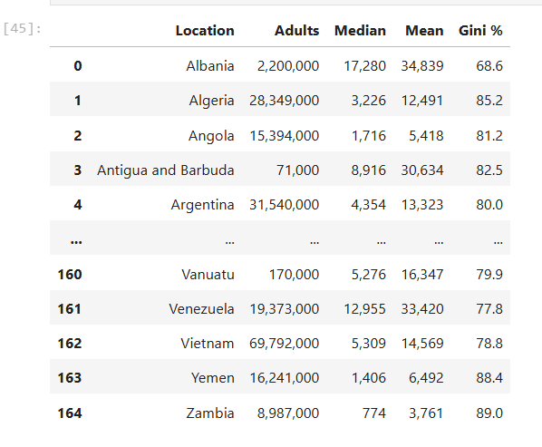

# Web Scraping and Data Export Project

## Overview
This project demonstrates the process of web scraping using Python and Pandas. The script scrapes data from a Wikipedia page, processes it in a Jupyter Notebook, converts it into a Pandas DataFrame, and finally exports it to a CSV file for further analysis.

## Tools and Libraries
- **Python 3.x**
- **Jupyter Notebook**
- **Pandas**: For data manipulation and processing.
- **BeautifulSoup**: For web scraping.

## Steps Taken
1. **Web Scraping**:
   - The Wikipedia page was used as the source of data( "https://en.wikipedia.org/wiki/List_of_countries_by_wealth_per_adult").
   - Data was scraped using `BeautifulSoup`.
   
2. **DataFrame Creation**:
   - Scraped data was cleaned and structured into a Pandas DataFrame.

3. **Data Export**:
   - The final DataFrame was exported as a CSV file for future use.

## Code Overview
### Web Scraping
- Parsed the Wikipedia page using `BeautifulSoup`.
- Extracted specific tables and lists of interest.

### DataFrame Creation
- Converted the extracted HTML table into a Pandas DataFrame.
- Cleaned and formatted the data.

### Data Export
- Used Pandas to save the cleaned data into a `data.csv` file.

## Final Dataset

